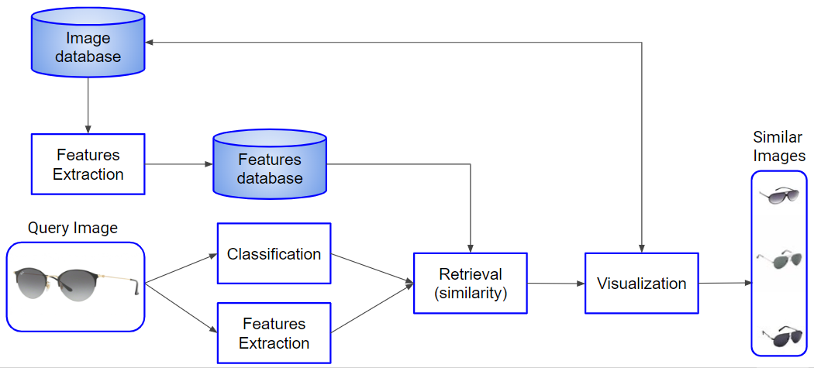

# Content-Based Fashion Image Retrieval #

## Group Members ##
* Fabio Cimmino
* Roberto Lotterio
* Gianluca Puleri

## Description ##
We have realized a system which allows the retrieve of the similar images given a query image.
We have implemented 4 methods of features extraction:
* SIFT with BOVW
* Daisy
* Deep Method
* Color

Given the query image:
1. we classify it
2. we extract, with these 4 methods, the features of each image contained into the dataset
3. we compute the similarity between the features of the query image and those of the dataset

The features of each image contained into the dataset are previously computed and then saved.

## Solution design ##


## How to run ##
1. Create a new bot on Telegram by opening a chat with @BotFather
2. Send command /newbot
3. When asked, insert a name and a username for your new bot
4. BotFather sends you the token to access to your bot
5. Open the file server_launcher.py and change the bot_id variable by assigning the token previously taken
6. Launch the script that will become the server of your Telegram bot (requires python 3)
  ``` python server_launcher.py``` 
7. Test it by opening a chat with your just-created bot and send to it a picture.
